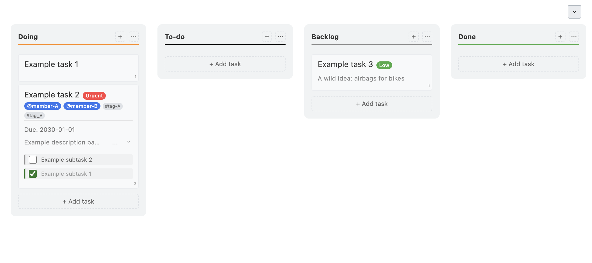

# Minimal To-do - A task manager with Kanban board for an AI world

The most lightweight, standalone Kanban board To-do app with separate Markdown storage. A single HTML-file for the User Interface, and a single Markdown file for storage. For a world where AI needs access to our task list more than we do.

## Screenshots




## Quick Start

Start a local server to use the Kanban board. Here's how:

1. **Open a Terminal/Command Prompt** and navigate to the folder containing your files
2. **Run:** `python3 -m http.server 8000` in the folder containing your files
3. **Visit:** [http://localhost:8000/todo.html](http://localhost:8000/todo.html)

*Don't just double-click the HTML file - it won't work! You need to run a temporary server instance to use the todo.md file for storage.*

## Benefits

- **2️⃣ Only two files**: todo.md and todo.html
- **🍳 No installation**: Works in any browser
- **💧 Drop-in simplicity**: Just drop the todo.md and todo.html files into a folder
- **🌐 Always available**: Lives with your project, accessible to any team member with browser access
- **🤖 AI-friendly**: Markdown format works perfectly with AI tools and version control
- **🪶 Lightweight alternative**: Much simpler than heavy project management tools or complex todo apps
- **🔧 No dependencies**
- **📜 Open source**: MIT license for complete freedom

## Features

- **📋 Kanban Board**: Visual task management with customizable columns (Doing, To-do, Backlog, Done)
- **🎯 Task Management**: Create, edit, delete, and organize tasks with drag & drop
- **🏷️ Smart Organization**: Priority levels (urgent, high, normal, low) and keyword tags
- **📝 Subtasks**: Break down tasks into manageable subtasks
- **🌓 Theme Toggle**: Dark and light mode support
- **⌨️ Keyboard Navigation**: Full keyboard support for accessibility
- **📱 Responsive Design**: Works on desktop and mobile devices
- **💾 Auto-save**: Changes are automatically saved to your todo.md file
- **🔧 No Installation**: Single HTML file - just open in your browser

## How to Use

### **OPTION 1**: Use the Kanban board in your browser using todo.html AND/OR the todo.md file simultaneously.

1. **Start a quick, disposable local server to use the Kanban board**:
   ```bash
   # Python 3 (recommended)
   python3 -m http.server 8000
   
   # Alternative commands
   python -m http.server 8000          # If python3 doesn't work
   npx http-server -p 8000            # Node.js (note the -p 8000 flag)
   php -S localhost:8000              # PHP built-in server
   ```

2. **Open in browser**: Go to `http://localhost:8000/todo.html`

3. **Enable Editing Mode** (OPTIONAL): Click "Enable Editing Mode" to unlock full task management features

### **OPTION 2**: Use the todo.md file to list tasks. Ignore or delete the Kanban board todo.html file.

## Browser Compatibility

**✅ Supported:**
- Chrome
- Edge  
- Brave
- Opera

**❌ Not Supported yet:**
- Firefox
- Safari

# Task Elements
- **Priority**: Add `- Urgent`, `- High`, `- Normal`, or `- Low` at the end (don't forget the dash -)
- **Keywords**: Use hashtags like `#project #urgent #meeting`
- **Subtasks**: Start your indentation with 2 spaces for subtasks, e.g. `  - `

## About the Editing Mode

Click "Enable Editing Mode" to unlock:
- **Drag & Drop**: Reorder tasks within and between columns
- **Inline Editing**: Double-click tasks to edit content, priority, and keywords
- **Add/Delete**: Create new tasks and delete existing ones
- **Column Management**: Add, rename, or delete status columns
- **Subtask Management**: Add, edit, and delete subtasks

## Keyboard Navigation

- **Tab**: Navigate between interactive elements
- **Enter**: Activate buttons and edit tasks
- **Arrow Keys**: Navigate between tasks (in editing mode)
- **Delete/Backspace**: Delete tasks (in editing mode)
- **Escape**: Cancel operations and close modals

## Security

This app is designed for local use only on trusted devices. Since you're running this on your own machine with your own todo.md file, security is primarily about protecting your data integrity:

- **Local execution only**: Runs entirely in your browser, no external servers
- **File access**: Uses File System Access API to read/write your local files
- **Content trust**: Assumes your todo.md content is safe and trusted
- **No network calls**: Only loads external Google Fonts for typography
- **Browser security**: Relies on your browser's built-in security features

**Security considerations for local use:**
- Copy-pasting untrusted content into tasks could execute scripts
- File picker could accidentally access system directories
- Browser localStorage stores app state locally

For production or multi-user environments, additional security measures would be required.

## Contributing

**Seeking contributions!**

There's a lot of things that need to improve. It's nowhere near as user-friendly and feature-rich as the big commercial Kanban boards like Trello, ClickUp or Jira.

Your help is very welcome.

Areas for improvement:
- Enhanced task filtering and search
- Better mobile experience
- Additional task properties (due dates, assignees)
- Import/export functionality
- Better accessibility features
- Better browser compatibility

Limitation:
- vanilla JavaScript to avoid compilation

## Contact

* [xpiu](https://github.com/xpiu)

## License

MIT License 